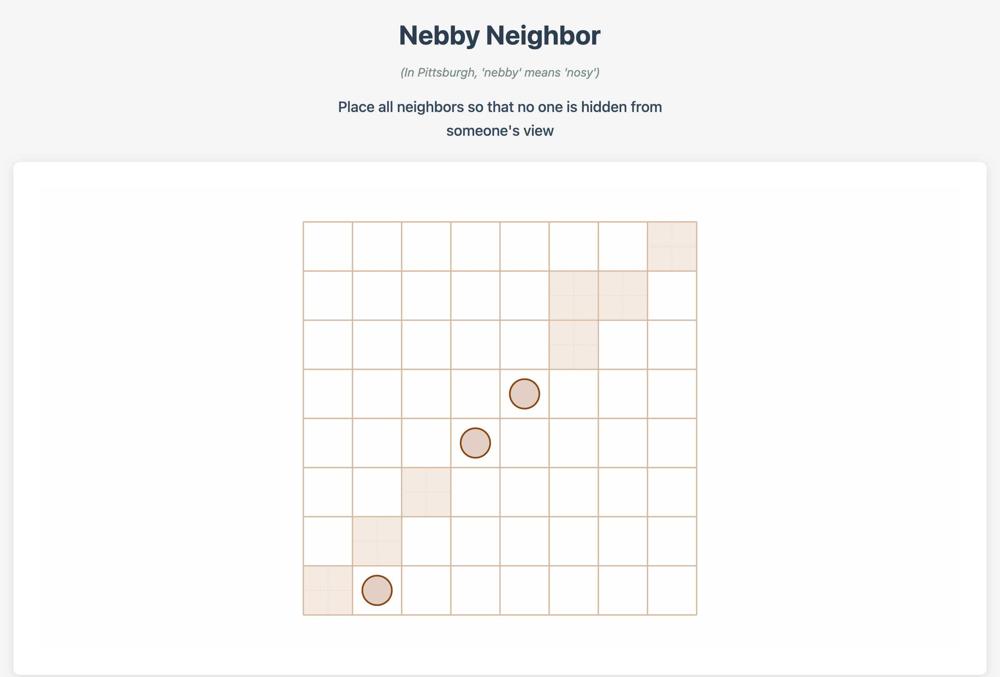

# Issue #6: Line Detection & Constraint Visualization

## Implementation Summary

Successfully implemented real-time line detection system with visual constraint feedback for the no-three-in-line problem.

## Key Features

- **Real-time constraint calculation**: Forbidden squares update immediately when neighbors are placed
- **All slope support**: Handles horizontal, vertical, diagonal, and arbitrary slope ratios
- **Visual feedback**: Three distinct theme approaches for forbidden square highlighting
- **Performance**: Smooth operation on 8×8 grids with complex constraint networks
- **Integration**: Seamless workflow with existing neighbor placement system

## Visual Result

*8×8 grid showing line detection in action with the Organic theme's "Grid Fade" style. Pre-placed neighbors at (7,1), (3,4), and (4,3) create diagonal constraint patterns visible as grayed-out squares.*

## Technical Architecture

### Core Components

- **LineDetector**: Geometric algorithm using rise/run representation
- **GridState.forbiddenSquares**: Real-time constraint tracking
- **GridRenderer.drawForbiddenSquares()**: Multi-style visual rendering

### Visual Themes

1. **Organic (Grid Fade)**: Faded background with dashed inner grid pattern
2. **Minimal (Subtle Overlay)**: Light gray semi-transparent overlay  
3. **Bold (Cross Hatch)**: Diagonal line pattern for high-contrast feedback

## Algorithm Approach

Selected geometric line-by-line approach over brute force:
- O(n²) complexity suitable for current problem domain
- Rise/run representation avoids floating-point precision issues
- GCD normalization ensures consistent line equation representation
- Architecture supports future constraint explanation features

## Testing

- ✅ 4×4 grids: Basic constraint patterns
- ✅ 8×8 grids: Complex diagonal relationships and performance
- ✅ Theme switching: All visual styles functional
- ✅ Real-time updates: Immediate constraint recalculation

## Files Modified

- `src/game/engine/LineDetector.ts` - New: Core line detection algorithm
- `src/game/engine/GridController.ts` - Integration with constraint system
- `src/game/types/grid.ts` - Added forbiddenSquares to GridState
- `src/game/ui/GridRenderer.ts` - Visual rendering of constraints
- `src/game/ui/GridThemes.ts` - Theme-specific constraint styling
- `src/main.ts` - Default 8×8 grid configuration

## Development Tools

- `docs/development/issue-6/line-detection-test.html` - Interactive testing interface with theme switching capabilities

---

**Status**: ✅ Complete  
**Grid Size**: 8×8 default  
**Themes**: 3 visual approaches implemented  
**Performance**: Validated on larger grids